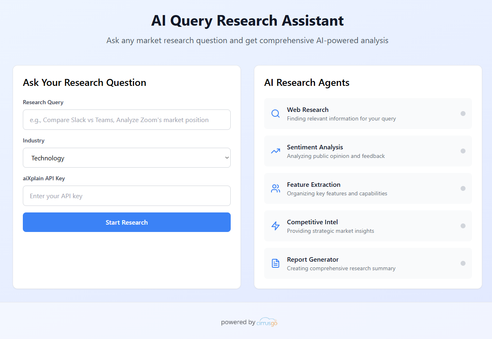

# aiXplain Market Research Platform

A powerful AI-driven market research platform that leverages the aiXplain SDK to perform comprehensive competitive analysis and market intelligence. The platform orchestrates multiple specialized AI agents to gather, analyze, and synthesize market data into actionable insights.



## Overview

This platform provides automated market research capabilities through a modern web interface backed by a team of specialized AI agents. Users can input a product or company name and receive detailed market analysis including competitive landscape, sentiment analysis, feature comparisons, and strategic recommendations.

### Key Features

- **Multi-Agent Research System**: Orchestrates 5 specialized AI agents for comprehensive analysis
- **Real-time Analysis**: Live progress tracking with status updates
- **Multiple Report Formats**: Generate reports in Markdown and PDF formats
- **Competitive Intelligence**: Automated competitor identification and analysis
- **Sentiment Analysis**: Customer feedback and market sentiment evaluation
- **Feature Analysis**: Product feature extraction and comparison
- **Interactive UI**: Modern React-based web interface with real-time updates

## Architecture

The platform consists of several components:

### AI Agents
- **Web Research Agent**: Gathers public information about companies and products
- **Sentiment Agent**: Analyzes customer feedback and market sentiment
- **Feature Agent**: Extracts and categorizes product features
- **Intelligence Agent**: Provides competitive intelligence and market positioning
- **Report Agent**: Synthesizes findings into actionable business insights

### Technical Stack
- **Frontend**: React with Tailwind CSS
- **Backend**: FastAPI (Python)
- **AI Platform**: aiXplain SDK
- **Report Generation**: Markdown to PDF conversion
- **Deployment**: Docker support included

## Quick Start

### Prerequisites

- Python 3.8+
- Node.js 16+
- aiXplain API key ([Get one here](https://platform.aixplain.com))

### Installation

1. Clone the repository:
```bash
git clone https://github.com/your-username/aixplain-market-research.git
cd aixplain-market-research
```

2. Install Python dependencies:
```bash
pip install -r requirements.txt
```

3. Install frontend dependencies:
```bash
npm install
```

4. Set up environment variables:
```bash
export AIXPLAIN_API_KEY="your_api_key_here"
```

### Running the Application

1. Start the backend API:
```bash
uvicorn api:app --host 0.0.0.0 --port 8000 --reload
```

2. Start the frontend (in a new terminal):
```bash
npm start
```

3. Open your browser and navigate to `http://localhost:3000`

## Usage

1. **Enter Research Target**: Input the product or company name you want to research
2. **Select Industry**: Choose the relevant industry category
3. **Provide API Key**: Enter your aiXplain API key
4. **Start Analysis**: Click "Start Analysis" to begin the research process
5. **Monitor Progress**: Watch real-time updates as each agent completes its task
6. **Download Reports**: Once complete, download your reports in Markdown or PDF format

## API Endpoints

The backend provides several REST API endpoints:

- `GET /health` - Health check
- `POST /run-agent` - Start market research analysis
- `GET /results/{job_id}` - Get analysis results
- `GET /download/{job_id}.md` - Download Markdown report
- `GET /download/{job_id}.pdf` - Download PDF report
- `GET /download/{job_id}/citations.json` - Download citations

## Docker Deployment

Build and run using Docker:

```bash
# Build the image
docker build -t market-research-platform .

# Run the container
docker run -p 8000:8000 -e AIXPLAIN_API_KEY="your_api_key" market-research-platform
```

## Project Structure

```
├── agent.py              # Main market research agent logic
├── api.py                # FastAPI backend server
├── tools.py              # Utility functions and tools
├── src/                  # React frontend application
├── generated_reports/    # Output directory for reports
├── public/              # Static assets
├── requirements.txt     # Python dependencies
├── package.json         # Node.js dependencies
└── Dockerfile          # Container configuration
```

## Contributing

1. Fork the repository
2. Create a feature branch (`git checkout -b feature/amazing-feature`)
3. Commit your changes (`git commit -m 'Add some amazing feature'`)
4. Push to the branch (`git push origin feature/amazing-feature`)
5. Open a Pull Request

## License

This project is licensed under the MIT License - see the [LICENSE](LICENSE) file for details.

## Acknowledgments

This project is developed by **Cirrusgo** and powered by the aiXplain platform for AI orchestration and model management.

---

For more information about aiXplain, visit [platform.aixplain.com](https://platform.aixplain.com)